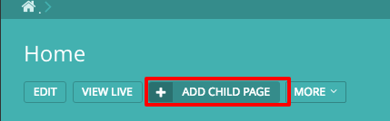
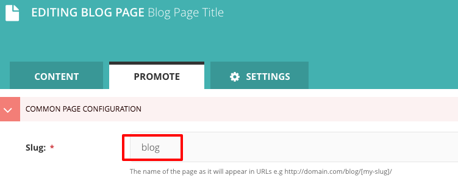
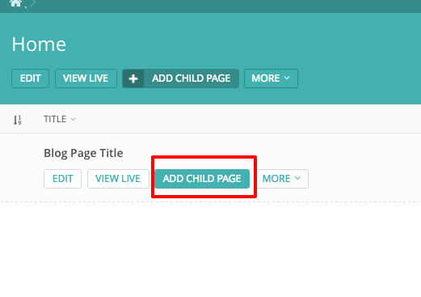
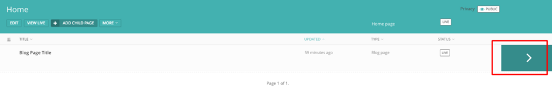
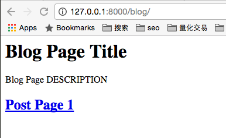
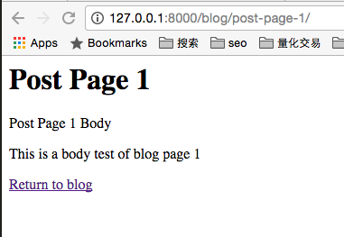

# Chapter 2 Create Data Model

A model in Wagtail is a special kind of object, it is saved in the database. If you are newbie developer, you can think of a model in the database as a spreadsheet with columns (fields) and rows (data). If you check the source code of Wagtail, you will find that some model class in Wagtail is actually a Django data model, which means if you have some experience in Django, then it will be easier for you to learn Wagtail CMS.

In this chapter, I will show you how to create data model which used by blog application and explain some key points. You can get the source code of this chapter at the end of this chapter.

### Start To Play With Data Model

Now we are ready to create a real blog now. First, run `python manage.py startapp blog` to create new app in this Django project, then add `blog` to `INSTALLED_APPS` in `wagtail_tuto/settings/base.py` to enable it in this django project.

In this blog app, now we need two types of model, one is `BlogPage` which is the root page of our blog site, it has some fields such as blog title, blog description. The other is `PostPage` which has fields such as body to save the content of post page. All `PostPage` object are contained by `BlogPage`.

Now edit `blog/models.py`

```python
# -*- coding: utf-8 -*-
from __future__ import unicode_literals

from django.db import models

from wagtail.wagtailcore.models import Page
from wagtail.wagtailcore.fields import RichTextField
from wagtail.wagtailadmin.edit_handlers import FieldPanel

class BlogPage(Page):
    description = models.CharField(max_length=255, blank=True,)

    content_panels = Page.content_panels + [
        FieldPanel('description', classname="full")
    ]

class PostPage(Page):
    body = RichTextField(blank=True)

    content_panels = Page.content_panels + [
        FieldPanel('body', classname="full"),
    ]
```

There are some points you should notice here, first, we create two models here, and they both inherit from the `Page` class from wagtail, **if you want your model supported in wagtail, you should follow this pattern.**

Second, you can define custom fields as you wish, and you can use the fields from Django built-in fields or some fields from Wagtail. Here, the `description` is from Django and `body` is from Wagtail fields because I need more Wagtail support in Wagtail admin page. If the `body` is pure text object, then it would drive people crazy when editing it in admin page.

Third, we wrap the fields we created in the `content_panels`, which config how the fields are edited in wagtail admin. You should know that if you do not include your fields in `content_panels`, then you can not edit it in Wagtail admin page.

After we save the code, we need to migrate the DB.

```bash
python manage.py makemigrations
python manage.py migrate
```

### Hierarchical “Tree”

I must say this part is the key part of Wagtail, however, many articles talking about Wagtail did not talk about this in detail. So you should read this part carefully and try to understand it well.

Now login into the admin page `http://127.0.0.1:8000/admin/` of Wagtail and take a look at it. Click `Explorer/Home` to enter the home page. Since this home page is the root page of localhost, now we create blog page as child page of it. Click `Add child page` button in the top panel, choose `Blog page` and insert some text in title and description.



What you should be careful is the slug value in promote tab, because the url of this blog page will be `http://127.0.0.1:8000/[slug]`. Here to make it easy to understand, I set the value `blog`, so the url of this blog page become `http://127.0.0.1:8000/blog/`. At last, we click publish button at the bottom to submit the values to database.



After we create a blog page, we can add some post pages as its children, we click `Explorer/Home` to go back to home page, and then click `add child page` in the blog page we just created, then choose `Post page`. **What you should notice here is the button `add child page` in top panel is to add child to home page, and the `add child page` in the blog panel is to add child page to blog page, which has different effect. You can also see the difference from the title of link**



We use this method to create multiple post pages as the children of blog page. If you want to see the list of children of blog, click the button in the next image.



Now the pages we just created will have tree structure like this.

```
/
    home/
        blog/
            post-page-1/
            post-page-2/
            post-page-3/

```

As you know, `home` is create by migration file and it has been set as root page of localhost, so now if we visit url `http://127.0.0.1:8000/blog/`, then content of blog page will display, and if we visit url `http://127.0.0.1:8000/blog/post-page-1/` then the content of post page 1 will display. Can you figure out something here?

>Starting from the root page of that site, Wagtail traverses the page tree, calling the route() method and letting each page model decide whether it will handle the request itself or pass it on to a child page.

In this case, blog page pass the request to child page, that is why we can use `http://127.0.0.1:8000/blog/post-page-1/` to visit the post page.

### Create templates to show the content

create `blog/templates/blog/blog_page.html`

```django



    <h1>{{ page.title }}</h1>

    <div class="intro">{{ page.description }}</div>

    
        <h2><a href="">{{ post.title }}</a></h2>
    


```

create `blog/templates/blog/post_page.html`

```django



    <h1>{{ page.title }}</h1>

    {{ page.body|richtext }}

    <p><a href="{{ page.get_parent.url }}">Return to blog</a></p>


```

As you can see, in the template, we use `get_children` and `get_parent` to get the children and parent of the page, and we use page object to get the value of our page model, and richtext filter to render richtext data.

Now we can check the blog in browser.



We can click the blog like to check the blog content.



### Conclusion

In this chapter, we create basic blog which has two relevant models, has an understanding of the hierarchical “tree”, and create templates to show the relationship between them.

To help user focus on the key part, I only paste part of the source code instead of the whole file in this tutorial, If you want source code which can run in your local env directly, just use the commands below.

```bash
git clone https://github.com/michael-yin/wagtail_tuto.git
cd wagtail_tuto
git checkout 50915b3

# setup virtualenv
pip install -r requirements.txt

./manage.py runserver
```

Remember to use username `admin` and password `admin` to login in the wagtail CMS admin page.
