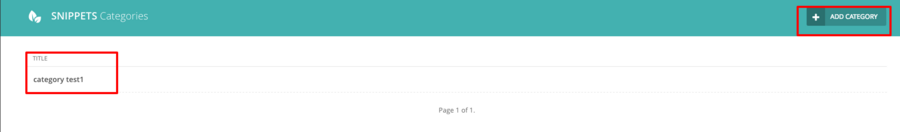
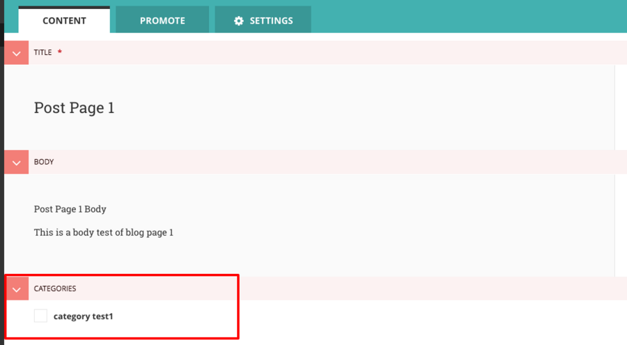
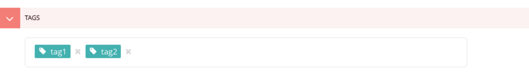
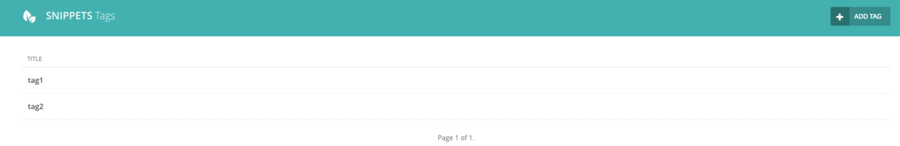
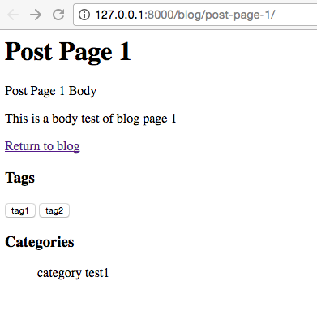

# Chapter 3 Category And Tag Support

Categories allowed for a grouping of blog posts, but if you want to describe your posts in more specific terms, then you will get a very long category list, that is why we no have tags. In this chapter, I will continue to move on to help you add category and tag support to post page as standard CMS does.

### Categories

Now we start to add category to the blog, to make it simple to understand, here the category list will be a flattened list, I will talk about nested category in later article.

Considering the category is not a standard blog post page, so it should not inherit from wagtail `Page` model, instead, it should be a django `models.Model`.

Wagtail has a concept called `snippets` for some contents need to be managed in wagtail admin, model can be registered as `snippet` by add `@register_snippet` decorator. After that, you can manage category info directly in Wagtail admin, you can see it as a hook.

```python
@register_snippet
class BlogCategory(models.Model):
    name = models.CharField(max_length=255)
    slug = models.SlugField(unique=True, max_length=80)

    panels = [
        FieldPanel('name'),
        FieldPanel('slug'),
    ]

    def __str__(self):
        return self.name

    class Meta:
        verbose_name = "Category"
        verbose_name_plural = "Categories"
```

Here is a very simple category model, I created two fields, since snippet is simpler than wagtail page, so we use panels here instead `content_panels`, `promote_panels`. You should also remember that if you do not include something in `panels`, then you can not edit category info in Wagtail admin page.

Now we need to create some relationships between `BlogCategory` and `PostPage`.

```python
from modelcluster.fields import ParentalKey, ParentalManyToManyField

class PostPage(Page):
    body = RichTextField(blank=True)
    categories = ParentalManyToManyField('blog.BlogCategory', blank=True)
    content_panels = Page.content_panels + [
        FieldPanel('body', classname="full"),
        FieldPanel('categories', widget=forms.CheckboxSelectMultiple),
    ]
```

Considering the many to many relationships between category and post page, here we use a `ParentalManyToManyField` from `modelcluster` package. **What you should keep in mind that we do not use Django `ManyToManyField` here because we need keep related models stored in parent model sometime to support page preview, enable `draft` state. In the same way, you should replace `ParentalKey` with `ForeignKey` for one-to-many relationship.**

To make people can select category when editing blog post, we use `widget=forms.CheckboxSelectMultiple` to told Wagtail to import that widget in edit form for us. After we define the new models, we need migrate the DB.

```bash
python manage.py makemigrations
python manage.py migrate
```

Now we check if the category works as we expect. Go to Wagtail admin page, Click `snippets` in the left menu, then click the `Categories`, we enter the list of category list page, since we have no category here, so we start to add one.



After we create some categories, we can now add category to existing post page. We now navigate to the post page and click the edit button. 



Now we can create, edit category info as we like. There is only one little problem in this solution, you can not directly create new category when editing blog post, you should create it under `snippets` page, then select it to save.

### Tags

Now we need to add tag support for better user experience. Actually, Wagtail has support for tag function based on `django-taggit`, so first we need install the package. `pip install django-taggit`

Then edit the `blog/models.py`

```python
from taggit.models import TaggedItemBase, Tag as TaggitTag

class BlogPageTag(TaggedItemBase):
    content_object = ParentalKey('PostPage', related_name='post_tags')

@register_snippet
class Tag(TaggitTag):
    class Meta:
        proxy = True
```

As you can see, our intermediary model is a subclass of `TaggedItemBase`, which allow us to do some customization. If you are using `taggit` with other Django projects, then the code should be `content_object = models.ForeignKey('PostPage')`, however, as I said above, you should use `ParentalKey` instead of ForeignKey with Wagtail `Page` model.

To enable us to manage tag in `snippet`, we set Tag as proxy of Tag from `taggit` package. Now we turn back to `PostPage` to create connections between `PostPage` and `Tag`

```python
from modelcluster.fields import ParentalKey, ParentalManyToManyField
from modelcluster.tags import ClusterTaggableManager

class PostPage(Page):
    body = RichTextField(blank=True)
    categories = ParentalManyToManyField('blog.BlogCategory', blank=True)
    tags = ClusterTaggableManager(through='blog.BlogPageTag', blank=True)
    content_panels = Page.content_panels + [
        FieldPanel('body', classname="full"),
        FieldPanel('categories', widget=forms.CheckboxSelectMultiple),
        FieldPanel('tags'),
    ]
```

We use `ClusterTaggableManager` to help use handle tags relationship, and add `FieldPanel` to content_panels to enable us to edit tags in admin page. 

```bash
python manage.py makemigrations
python manage.py migrate
```

We now go to edit our `post page`, in the tags input, we can type one word and press `enter` key to insert new tag



After we publish the article, we goto `snippet/tags` to check the tag list.




### Show tags and categories in templates

After we add category and tag support to our data models, we can test to see if they work as expect. Now we start to edit the post page template to show the category info and tag info of post page.

```django

    <div class="tags">
        <h3>Tags</h3>
        
            <button type="button">{{ tag }}</button>
        
    </div>



    
        <h3>Categories</h3>
        <ul>
            
                <li style="display: inline">
                    {{ category.name }}
                </li>
            
        </ul>
    

```

As you can see, we use tags and categories to access the info we need. Go to `http://127.0.0.1:8000/blog/post-page-1/` to check the result.



### Conclusion

In this chapter, we add category and tags support to our blog and it become more and more usable now. What you should keep in mind is that this part is somewhat hard for newbie developer to understand how it work, which will not be a big problem. I suggest you to copy the code from this chapter or github repo to make your application run first, then you can start to test your code by doing some modification.

To help user focus on the key part, I only paste part of the source code instead of the whole file in this tutorial, If you want source code which can run in your local env directly, just use the commands below.

```bash
git clone https://github.com/michael-yin/wagtail_tuto.git
cd wagtail_tuto
git checkout 070d8de

# setup virtualenv
pip install -r requirements.txt

./manage.py runserver
```

Remember to use username `admin` and password `admin` to login in the wagtail CMS admin page.
