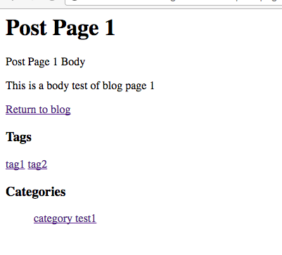

# Chapter 4 Routable Blog Page

If you have used some CMS such as WordPress, you must know that the permanent link of post, category link can be customized, so how to implement the same feature in Wagtail application? In this chapter, I will show you how to use `RoutablePageMixin` to make our blog **routable**, so our blog can handle some types of sub urls such as category and tag. This is a very powerful feature of wagtail, however, the doc of Wagtail or some other blog posts did not talk much about this point, so I will try to make this point clear in this chapter.

### Router

As I mentioned before, the URL of our blog posts are generated from the hierarchical tree by default, but sometimes if you want to change the way of handling the sub urls for a blog page, the `RoutablePageMixin` can help us make things done.

Here is quote from wagtail official doc:

> A `Page` using `RoutablePageMixin` exists within the page tree like any other page, but URL paths underneath it are checked against a list of patterns. If none of the patterns match, control is passed to subpages as usual (or failing that, a 404 error is thrown).

So here we start to make our blog page can handle custom url like `http://127.0.0.1:8000/blog/category/category_test_1/` and `http://127.0.0.1:8000/blog/tag/test_tag/`

First, activate `RoutablePageMixin` by adding `wagtail.contrib.wagtailroutablepage` to INSTALLED_APPS of settings.py

```python
INSTALLED_APPS = [
   ...
   "wagtail.contrib.wagtailroutablepage",
   ...
]
```

We need to make the `BlogPage` inherit from both `wagtail.contrib.wagtailroutablepage.models.RoutablePageMixin` and `wagtail.wagtailcore.models.Page`, then create view methods and decorate them with `wagtail.contrib.wagtailroutablepage.models.route`

**You should care about the order when changing the code because it has not been mentioned in the doc of wagtail. If the `Page` is located before the `RoutablePageMixin`, the route function would fail**

```python
class BlogPage(RoutablePageMixin, Page):

    def get_posts(self):
        return PostPage.objects.descendant_of(self).live()

    @route(r'^tag/(?P<tag>[-\w]+)/$')
    def post_by_tag(self, request, tag, *args, **kwargs):
        self.posts = self.get_posts().filter(tags__slug=tag)
        return Page.serve(self, request, *args, **kwargs)

    @route(r'^category/(?P<category>[-\w]+)/$')
    def post_by_category(self, request, category, *args, **kwargs):
        self.posts = self.get_posts().filter(categories__slug=category)
        return Page.serve(self, request, *args, **kwargs)

    @route(r'^$')
    def post_list(self, request, *args, **kwargs):
        self.posts = self.get_posts()
        return Page.serve(self, request, *args, **kwargs)
```

Above is part of BlogPage, as you can see, we make the `BlogPage` inherited from `RoutablePageMixin` and `Page`, then we add some view functions and use `route` to decorate them. The parametre passed in `route` decorator is a regex expression. If you have no idea what regex is, just check this good [learning resource](https://pymotw.com/2/re/)

Now BlogPage can handle the sub url of category and tag, the view function can filter the posts based on parameters passed in.

### Customising context

Sometimes we need to add some extra value to the context, then the template can render it, which can keep our template clean and easy to maintain.

> All pages have a `get_context` method that is called whenever the template is rendered and returns a dictionary of variables to bind into the template.

```python
class BlogPage(RoutablePageMixin, Page):
    ....
    def get_context(self, request, *args, **kwargs):
        context = super(BlogPage, self).get_context(request, *args, **kwargs)
        context['posts'] = self.posts
        context['blog_page'] = self
        return context
```

As you can see, after router of `BlogPage` handle the HTTP request, `self.posts` is the collection of filtered posts, here we add it to context to make the templates can directly iterate it. We add `blog_page` to context to avoid call `page.get_children` or `page` which might confuse us.

Now edit `templates/blog/blog_page.html`

```django

    <h1>{{ blog_page.title }}</h1>

    <div class="intro">{{ blog_page.description }}</div>

    
         <h2><a href="">{{ post.title }}</a></h2>
    


```

Now the code of our template is much more readable, which make developer easy to maintain or troubleshoot.

### Reversing route urls

In the previous chapter, I displayed the category info and tag info in post page template, now we convert the info to links, so people can click the links to find more relevant posts.

Edit `templates/blog/post_page.html`

```django



    <div class="tags">
        <h3>Tags</h3>
        
            <a href="">{{ tag }}</a>
        
    </div>



    
        <h3>Categories</h3>
        <ul>
            
                <li style="display: inline">
                    <a href="">{{ category.name }}</a>
                </li>
            
        </ul>
    

```

As you can see, first, we load `wagtailroutablepage_tags` in our template, then we can use `` to ask wagtail reverse url for us. There are 3 parameters passed in `routablepageurl` here, first one is `blog_page`, which is added in `get_context` method, second one is name of router we created above, if you do not specify the router name, the method name would be used by default, third one is slug value.

Now we can see in the post url `http://127.0.0.1:8000/blog/2017/06/27/post-page-1/`, the category and tag all are links, and if we click the tag link like `http://127.0.0.1:8000/blog/tag/tag1/`, the router of `BlogPage` will call `post_by_tag` to handle the request and filter the posts with tag value, after the data is ready, the template of `BlogPage` will render it.



### Conclusion

In this chapter, we add router function to the blog root page and now it can handle more url patterns such as cateogry url and tag url. **Here I must say again the order of `RoutablePageMixin` and `Page` is important, if the order is wrong, the route function can not work as expect, `Page not found 404` error will be raised, so you should be careful about this point**. What is more, we learn about how to use `get_context` to add extra values to the context to keep our templates clean and readable.

To help user focus on the key part, I only paste part of the source code instead of the whole file in this tutorial, If you want source code which can run in your local env directly, just use the commands below.

```bash
git clone https://github.com/michael-yin/wagtail_tuto.git
cd wagtail_tuto
git checkout 3f28b44

# setup virtualenv
pip install -r requirements.txt

./manage.py runserver
# http://127.0.0.1:8000/blog/
```

Remember to use username `admin` and password `admin` to login in the wagtail CMS admin page.

