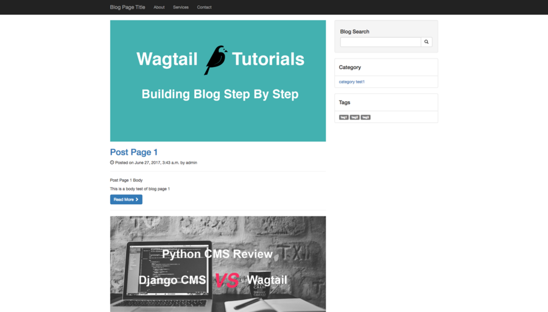

# Chapter 6 Import Theme Into Wagtail Blog

In this chapter, I will teach you how to quickly import an existing theme into wagtail blog to make our blog look more decent, it really makes sense especially when you want to import theme from WordPress or [themeforest](https://themeforest.net/), and I will talk about how to use `django-el-pagination` to add pagination to our blog app.

### Import bootstrap theme

To make reader easy to understand CSS, HTML during this process, the theme I will import is [bootstrap template](https://startbootstrap.com/template-overviews/blog-home/) from startbootstrap.com. This theme is a very clean theme and supports mobile device very well. Here is the screenshot from the preview website.


Let's download the theme file and take a look at what is in the file, here is the project structure.

```
├── LICENSE
├── README.md
├── css
│   ├── blog-home.css
│   ├── bootstrap.css
│   └── bootstrap.min.css
├── fonts
│   ├── glyphicons-halflings-regular.eot
│   ├── glyphicons-halflings-regular.svg
│   ├── glyphicons-halflings-regular.ttf
│   ├── glyphicons-halflings-regular.woff
│   └── glyphicons-halflings-regular.woff2
├── index.html
└── js
    ├── bootstrap.js
    ├── bootstrap.min.js
    └── jquery.js
```

As you can see, the `index.html` is the html source of blog page, `css`, `js`, `fonts` have static files to make the page display as expect. 

Now we start to import these files into our wagtail blog project, to make our blog app to a reusable Django app, I prefer to put these files in the blog app directory.

Create `static` directory in blog app, to make Django can point to the right static file, **remember to create blog directory and then put the fils in it**, this method called `Static file namespacing`.

```
.
├── blog
    ├── static
    │   └── blog
    │       ├── LICENSE
    │       ├── README.md
    │       ├── css
    │       │   ├── blog-home.css
    │       │   ├── bootstrap.css
    │       │   └── bootstrap.min.css
    │       ├── fonts
    │       │   ├── glyphicons-halflings-regular.eot
    │       │   ├── glyphicons-halflings-regular.svg
    │       │   ├── glyphicons-halflings-regular.ttf
    │       │   ├── glyphicons-halflings-regular.woff
    │       │   └── glyphicons-halflings-regular.woff2
    │       ├── index.html
    │       └── js
    │           ├── bootstrap.js
    │           ├── bootstrap.min.js
    │           └── jquery.js
    ├── templatetags
    │   ├── __init__.py
    │   └── blogapp_tags.py
    ├── tests.py
    ├── urls.py
    └── views.py
```

### Modify Template

Now the static files are ready to go, next step is to modify the blog page templates. Since it is a tedious job, I will write some points you should keep in mind here.

- Finish first, improve second.
- Copy the html from theme file to blog page template, change static path to make it work with django static files.

```django

<link href="" rel="stylesheet">
```

- Modify code to enable it to show the contents from blog posts as expected.

```django

    
        
        </img>
    
    <h2>
        <a href="">{{ post.title }}</a>
    </h2>
    <p>
        <span class="glyphicon glyphicon-time"></span> Posted on {{post.date}} by {{post.owner}}
    </p>
    <hr>
    
        {{ post.excerpt|richtext }}
    
        {{ post.body|richtext|truncatewords_html:40 }}
    
    <a class="btn btn-primary" href="">Read More <span class="glyphicon glyphicon-chevron-right"></span></a>
    <hr>

```

- If needed, create components to make the html structure easy to manage, for example, base.html, sidebar.html, header.html etc..

```django
<div class="col-md-8">
    
    
</div>

```

**If you want to get the full source code of blog_page.html, check the code at the end of this tutorial.**

### Template Tags

For some reason, we need do some extra job to make the category and tags work as we expect since there is no direct way to display it in template. Do you remember I use blogapp_tags to extend the function of Django template in the previous chapter?  We use the same way to create some custom Django template tags.

Edit `blog/templatetags/blogapp_tags.py`

```python
from ..models import BlogCategory as Category, Tag

@register.inclusion_tag('blog/components/tags_list.html', takes_context=True)
def tags_list(context, limit=None):
    blog_page = context['blog_page']
    tags = Tag.objects.all()
    if limit:
        tags = tags[:limit]
    return {'blog_page': blog_page, 'request': context['request'], 'tags': tags}

@register.inclusion_tag('blog/components/categories_list.html', takes_context=True)
def categories_list(context):
    blog_page = context['blog_page']
    categories = Category.objects.all()
    return {'blog_page': blog_page, 'request': context['request'], 'categories': categories}
```

From the code above, you can see I create two template tags, one is to show all tags of blog app, the other is to show all category links of blog app. The data returned from the function will be used to render html in template included in decorator.

I will paste the code of `blog/components/categories_list.html` here so you can better understand the workflow.

```django


<ul class="list-group">
    <li class="list-group-item">
        <h4> 
            Category
        </h4>
    </li>

    
        <li class="list-group-item">
            <a href="">
                <i class="icon-folder-open icon-large"></i>
                {{ category.name }}
            </a>
        </li>
    

</ul>
```

Variable `categories` here is the value returned by `categories_list` function, the returned dict can be seen as a context, which would be used to render HTML with `blog/components/categories_list.html`. After all stuff setup, we can just show the category links in blog_page.html by writing ``. which is very clean and TRY.

### Use Django-el-pagination To Provide Pagination In Wagtail

To make our blog support pagination, we use `django-el-pagination` to provide this fucntion, the reason I choose `django-el-pagination` here is it is easy to customize it and the repo on Github is activity maintained.

```
pip install django-el-pagination
# add 'el_pagination' in the INSTALLED_APPS of settings.py to activate it
```

Now el_pagination is ready to be called, first we try to use in in our template, edit `blog/templates/blog/blog_page.html`

```django







<ul class="pagination">
    
</ul>
```

There are some points you should notice from the code above:

1. Remember to load `el_pagination_tags` in template before use it
2. For collection you want to paginate, call `` to paginate, the `5` here is the number posts displayed per page, change it if needed.
3. Call `show_pages` to generate the pagination HTML in template

It is so easy! Right? But wait, how to change the pagination HTML generated because it seems so ugly? We can override the template of `el_pagination_tags` to change the html generated.

To make blog app more reusable, we create the template in `blog/templates/el_pagination`

```
.
├── README.md
├── blog
│   ├── templates
│   │   ├── blog
│   │   └── el_pagination
│   │       ├── current_link.html
│   │       ├── page_link.html
│   │       └── show_pages.html
```

Now let me explain what is the meaning of the template here. `current_link.html` it use to show the current link, `page_link.html` is used to show links other than current link, `show_pages.html` can be ignored here.

Edit `current_link.html`

```django
<li class="active">
    <a href="{{ page.path }}"><span >{{ page.label|safe }}</span></a>
</li>
```

Edit `page_link.html`

```django
<li>
    <a href="{{ page.path }}" >{{ page.label|safe }}
    </a>
</li>
```

Now the pagination block looks more decent. Below is the screenshot of our blog page.



### Conclusion

In this Wagtail tutorial, I talked about how to import an existing theme into Wagtail project, mentioned some rules you should follow to make your Django app reusable, and explained how to add pagination to our Wagtail Blog app.

Due to the user experience, I only paste part of the source code instead of the whole file, If you want source code which can run in your local env directly, just

```bash
git clone https://github.com/michael-yin/wagtail_tuto.git
cd wagtail_tuto
git checkout 3f28b44

# setup virtualenv
pip install -r requirements.txt

./manage.py runserver
# http://127.0.0.1:8000/blog/
```
