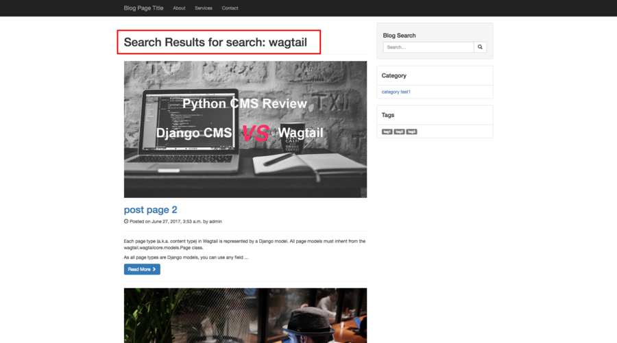

# Chapter 7 Add Search Function In Wagtail Blog

In this Wagtail tutorial, I will talk about how to implement search function in wagtail blog so the user can search the posts through keywords.

### Search Function In Model

Wagtail search can work on many backend systems such as Database and ElasticSearch, considering what we build is a blog app, I will focus on using Database as backend here because Elasticsearch is somewhat heavy for us. If you want to know more about using ElasticSearch as search backend, check the [offical doc](http://docs.wagtail.io/en/latest/topics/search/backends.html).

First, we continue to add a new route to our `BlogPage`, to make it can handle `search` path in URL.

```python
class BlogPage(RoutablePageMixin, Page):
    @route(r'^search/$')
    def post_search(self, request, *args, **kwargs):
        search_query = request.GET.get('q', None)
        self.posts = self.get_posts()
        if search_query:
            self.posts = self.posts.filter(body__contains=search_query)
            self.search_term = search_query
            self.search_type = 'search'
        return Page.serve(self, request, *args, **kwargs)
```

The method above is a view function handle the search request, we use `filter` method in Django ORM to filter the posts by search keywords. `body__contains` means to find posts, body of which contains the keywords, the query would be translated to SQL like this `SELECT ... WHERE body LIKE '%search_query%';`.

I find out there is no need to use the wagtail built-in `search` method here. If you read carefully, you will notice that there is `search_term` and `search_type` here, which I will talk about in a bit.

### Add search form in template

Now we need to add search form in our sidebar.html so use can enter the keyword in this form.

```django
<form role="search" method="get" class="form-search" action="" method="get">
    <div class="input-group">
        <input type="text" class="form-control search-query" name="q" placeholder="Search&hellip;" title="Search for:" />
        <span class="input-group-btn">
            <button type="submit" class="btn btn-default" name="submit" id="searchsubmit" value="Search"><span class="glyphicon glyphicon-search"></span>
        </button>
        </span>
    </div>
</form>
```

We use `routablepageurl` to resolve the search url for us, which has been explained in the previous tutorial, keyword will be sent through HTTP GET method, keyword can be found in http parameters with key `q`.

To make user can see the keywords wagtail has searched, we need to show the keywords in the template, that is why `search_query` and `search_type` has been used to tell us the search type (`search`, `tag`, `category`) and search keyword (`keyword`, `category name`, `tag name`).

We can add this to the bottom of the `blog_page.html`

```django

    <header class="page-header">
        <h1 class="page-title">Search Results for <span>{{ search_type }}: {{ search_term }}</span></h1>
    </header>


......
```

Here is the screenshot of our Wagtail Blog.



### Which Search Backend Should I Choose In My Wagtail Project?

Some people have no idea what backend they should use in wagtail project to support search I must say that depends on the data you want to index, if the data is big and you want the results to be more accurate, you should use big and heavy framework such as ElasticSearch, but based on my experience, most users have no need to import this tool. Remember to [check the hardware](https://www.elastic.co/guide/en/elasticsearch/guide/current/hardware.html) before choosing ElasticSearch.

`Solr` is another good options if you want full-text search function but have no powerful hardware.

If you have used `Haystack` in your project to support other custom search function, then I am sure you have met strange problem which told you `All documents removed. Updating backend: default: Backend doesn't require rebuild. Skipping` after importing Wagtail to your project.

The reason why this happens is the command name conflict, `update_index` exists in both frameworks, so Django can not determine which command should be called each time. So how to make both framework coexist in one project, you can find the solution and discussion [here](https://stackoverflow.com/questions/38469577/django-haystack-whoosh-empty-index-after-rebuild-index).

### Conclusion

In this Wagtail tutorial, I showed you how to implement search function in wagtail blog so user can find the posts through the keywords, and give you some tips about search function in Wagtail.

To make reader focus on the key part, I only paste part of the source code instead of the whole file, If you want source code which can run in your local env directly, just

```bash
git clone https://github.com/michael-yin/wagtail_tuto.git
cd wagtail_tuto
git checkout 2639536

# setup virtualenv
pip install -r requirements.txt

./manage.py runserver
# http://127.0.0.1:8000/blog/
```
