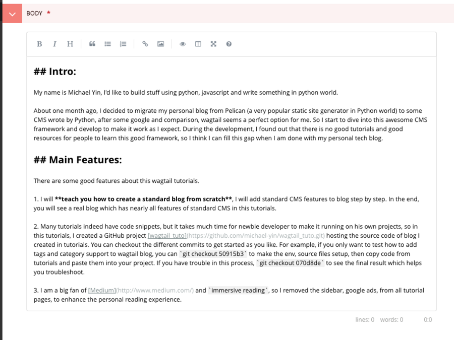
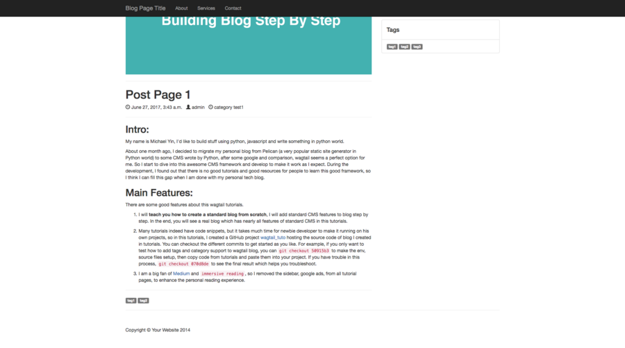

# Chapter 8 Add Markdown Support In Wagtail Blog

Considering more and more people are writing blog in Markdown, in this wagtail tutorial, I will show you how to add Markdown support to our Wagtail blog app.

### Import new MarkdownField and MarkdownPanel

Before we start, we should have a plan about how to implement this feature. Actually, there are mainly two points you should consider here, first, we should make user can edit Markdown in Wagtail admin page and save the content in Database, second, the content in markdown format should be rendered properly in our template page.

To make this Wagtail-Markdown support app reusable, we create a new app called `wagtailmd` here by using command `python manage.py startapp wagtailmd`, and activate it in `INSTALLED_APPS` of settings.py.

```bash
└── wagtailmd
    ├── __init__.py
    ├── utils.py
```

Here is the app structure, in `utils.py`, we create new Wagtail Filed and Wagtail Panel to make user save content in Markdown syntax into DB. Now we edit the `utils.py`.

```python
from django.db.models import TextField
from wagtail.wagtailadmin.edit_handlers import FieldPanel

class MarkdownField(TextField):
    def __init__(self, **kwargs):
        super(MarkdownField, self).__init__(**kwargs)

class MarkdownPanel(FieldPanel):
    def __init__(self, field_name, classname="", widget=None):
        super(MarkdownPanel, self).__init__(field_name, classname, None)

        if self.classname != "":
            self.classname += " "
        self.classname += "markdown"
```

Here we create `MarkdownField`, it is actually a built-in Django `TextField`, the value of this type would be treated as Text in Wagtail. What you should notice here is that we add classname called `markdown` in `MarkdownPanel`, then in Wagtail admin page we can know which edit panel is Markdown editor, later we can know how to use javascript to init the Markdown editor.

After we create new Filed and Panel, we can the blog post body type, so we can edit the `blog/models.py` in this way.

```python
class PostPage(Page):
    body = MarkdownField()

    content_panels = Page.content_panels + [
        MarkdownPanel("body"),
    ]

```

As you can see, now we change the body of `PostPage` to make it use Markdown syntax, and we also need to change the Panel in `content_panels` to change the online editor to Markdown editor.

Remember to migrate db after model change.

```bash
python manage.py makemigrations
python manage.py migrate
```

### Simplemde-Markdown-Editor

Of course we can use the native textarea as our Markdown editor, however, a powerful Markdown editor can help users a lot who are less familiar with Markdown syntax. That is the reason we import Simplemde into our Wagtail Blog.

We can download the Simplemde-Markdown-Editor and then import the css, js file into our project.

```bash
└── wagtailmd
    ├── __init__.py
    ├── static
    │   └── wagtailmd
    │       ├── css
    │       │   └── simplemde.min.css
    │       └── js
    │           ├── simplemde.attach.js
    │           └── simplemde.min.js
    └── utils.py
```

`simplemde.min.css` and `simplemde.min.js` is the file to run Simplemde-Markdown-Editor, `simplemde.attach.js` is the file added by us to insert some custom code.

Now we need to inject some code into the admin page of Wagtail, Wagtail has provided a way to help us get it done. 

> On loading, Wagtail will search for any app with the file `wagtail_hooks.py` and execute the contents.

Create file `wagtail_hooks.py`

```python
from django.conf import settings
from wagtail.wagtailcore import hooks

@hooks.register('insert_editor_js')
def editor_js():
    s = """<script src="{0}wagtailmd/js/simplemde.min.js"></script>"""
    s += """<script src="{0}wagtailmd/js/simplemde.attach.js"></script>"""
    return s.format(settings.STATIC_URL)

@hooks.register('insert_editor_css')
def editor_css():
    s = """<link rel="stylesheet" href="{0}wagtailmd/css/simplemde.min.css">"""
    s += """<link rel="stylesheet" href="https://maxcdn.bootstrapcdn.com/font-awesome/latest/css/font-awesome.min.css">"""
    return s.format(settings.STATIC_URL)
```

We injected css and js file through wagtail hooks, `simplemde.min.js`, `simplemde.min.css` and `font-awesome.min.css` are files needed for Simplemde to work, We can add some custom code in `simplemde.attach.js` to init the markdown editor, you can check the code of `simplemde.attach.js`.

```javascript
$(document).ready(function() {
    $(".markdown .field-content textarea").each(function(index, elem) {
        var mde = new SimpleMDE({
            element: elem,
            autofocus: false
        });
        mde.render();
    });
});
```

Code above search the elememt which have class value `markdown` and init the textarea. Now we can edit Markdown content using simplemde and save the content to DB as pure text. Here is the screenshot of the markdown editor.



### Render Markdown

Now we need to render the markdown content from DB. There are many third-party packages can be used, here we choose `Python-Markdown`. First, we install `Python-Markdown`, which help us render the Markdown.

```bash
pip install Markdown
```

Like `richtext` filter from Wagtail, we can create a custom Django template filter to render the markdown. Edit so we can create a Django tags here, create file `templatetags/wagtailmd.py`, then the app structure would seem like this.

```bash
└── wagtailmd
    ├── __init__.py
    ├── static
    │   └── wagtailmd
    │       ├── css
    │       │   └── simplemde.min.css
    │       └── js
    │           ├── simplemde.attach.js
    │           └── simplemde.min.js
    ├── templatetags
    │   ├── __init__.py
    │   └── wagtailmd.py
    ├── utils.py
    └── wagtail_hooks.py
```

```python
import markdown

register = template.Library()

@register.filter(name='markdown')
def markdown_filter(value):
    return markdown.markdown(
        value,
        output_format='html5'
    )
```

As you can see from the code above, we create a Django template filter and use Python-Markdown API to convert the markdown to html. Next we modify the post template to make it work.

```django




    <h1>{{ post.title }}</h1>
    <p>
        <span class="glyphicon glyphicon-time"></span> {{post.date}} &nbsp;
        <span class="glyphicon glyphicon-user"></span> {{post.owner}} &nbsp;
        
    </p>
    <hr>
    {{ post.body|markdown|safe }}
    <hr>
    

```

`{{ post.body|markdown|safe }}` is the magic here since it process body as markdown content.

Here is the screenshot of post page.



### Conclusion

In this Wagtail tutorial, I showed you how to import Markdown support to our wagtail blog app, you can enable Markdown in your wagtail project or even Django project since there is no big difference. To quickly import Markdown support into your own Wagtail project, you can just copy the wagtail_md and do some modification.

To help user focus on the key part, I only paste part of the source code instead of the whole file in this tutorial, If you want source code which can run in your local env directly, just

```bash
git clone https://github.com/michael-yin/wagtail_tuto.git
cd wagtail_tuto
git checkout 8e1901b

# setup virtualenv
pip install -r requirements.txt

./manage.py runserver
# http://127.0.0.1:8000/blog/
```
