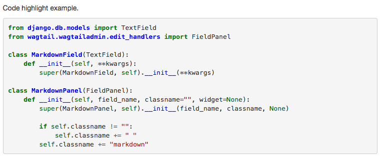
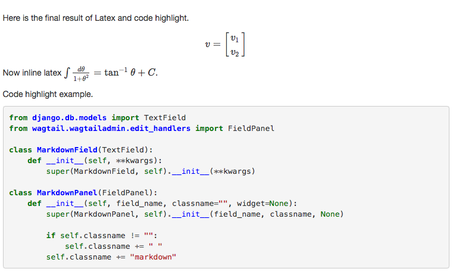

# Chapter 9 Add LaTeX Support & Code Highlight In Wagtail

Since Python is a very powerful tool in data science and LaTeX is a document preparation system for high-quality typesetting which includes features designed for the production of technical and scientific documentation, so in this chapter, I will talk about how to add latex support and code highlight support in our wagtail blog application.

### Add Code Highlight Support

In the previous tutorial, I have added Markdown support to this Wagtail Blog app using `python-markdown`  Package, actually, it is a very powerful package which supports extension to makes it possible to change, extend the behavior of the parser without having to edit the actual source files. Some extensions have been included with `python-markdown`, you can check the [official doc](https://pythonhosted.org/Markdown/extensions/index.html) to get more detail.

To make you understand how to use `python-markdown` extension, let me explain how to use built-in `markdown.extensions.codehilite`. This extension adds code highlighting to standard Python-Markdown code blocks. You should `pip install Pygments` before moving.

According to the doc, `markdown.extensions.codehilite` follows the same syntax as regular Markdown code blocks, and you can set the language after triple backticks.

````bash
```python
from django.db.models import TextField
from wagtail.wagtailadmin.edit_handlers import FieldPanel

class MarkdownField(TextField):
    def __init__(self, **kwargs):
        super(MarkdownField, self).__init__(**kwargs)

class MarkdownPanel(FieldPanel):
    def __init__(self, field_name, classname="", widget=None):
        super(MarkdownPanel, self).__init__(field_name, classname, None)

        if self.classname != "":
            self.classname += " "
        self.classname += "markdown"
```
````

Above is a sample markdown content, now change the `wagtailmd/templatetags/wagtailmd.py`

```python
@register.filter(name='markdown')
def markdown_filter(value):
    return markdown.markdown(
        value,
        extensions=[
            'extra',
            'codehilite',
        ],
        extension_configs = {
            'codehilite': [
                ('css_class', "highlight")
            ]
        },
        output_format='html5'
    )
```

The code above makes extension `codehilite` activated when parsing markdown, so the code block of markdown now would be processed by `codehilite`. and `highlight` class has been added to code block. Now choose one theme file from [pygments-css](https://github.com/richleland/pygments-css), here we `wget https://raw.githubusercontent.com/richleland/pygments-css/master/default.css`, add it to `blog/templates/blog/base.html`

```django
<link href="" rel="stylesheet">
```

Here is the screenshot of the code block



### Add LaTeX Support

So if we want to add LaTeX support to our wagtail, we can add another extension to the `markdown_filter` function, unfortunately, there is no built-in extension provide this function so we need to create a extension help us make things done.

```bash
└── wagtailmd
    ├── __init__.py
    ├── mdx
    │   ├── __init__.py
    │   ├── mdx_mathjax.py
```

As you can see, I created a extension mdx_mathjax.py in `wagtailmd/mdx` and below is the code, the source code of this extension can also be found [here](https://github.com/mayoff/python-markdown-mathjax)

```python
import markdown
import cgi

class MathJaxPattern(markdown.inlinepatterns.Pattern):
    def __init__(self, md):
        markdown.inlinepatterns.Pattern.__init__(self, r'(?<!\\)(\$\$?)(.+?)\2', md)

    def handleMatch(self, m):
        # Pass the math code through, unmodified except for basic entity substitutions.
        # Stored in htmlStash so it doesn't get further processed by Markdown.
        text = cgi.escape(m.group(2) + m.group(3) + m.group(2))
        return self.markdown.htmlStash.store(text)

class MathJaxExtension(markdown.Extension):
    def extendMarkdown(self, md, md_globals):
        # Needs to come before escape matching because \ is pretty important in LaTeX
        md.inlinePatterns.add('mathjax', MathJaxPattern(md), '<escape')

def makeExtension(configs=[]):
    return MathJaxExtension(configs)
```

**The key point here is the regex expression `(?<!\\)(\$\$?)(.+?)\2`, it would recognize `$...$` and `$$...$$`, so `python-markdown` would not process the content inside `$...$` and `$$...$$`.**

> In most cases, people would like to use `$...$` for inline math and `$$...$$` for multi-line math.

Now we add this extension to our custom Django filter

```python
return markdown.markdown(
    value,
    extensions=[
        'extra',
        'codehilite',
        'wagtailmd.mdx.mdx_mathjax',
    ],
    extension_configs = {
        'codehilite': [
            ('css_class', "highlight")
        ]
    },
    output_format='html5'
)
```

As you can see, `extra`, `codehilite` are the extensions shipped with `python-markdown`, and `wagtailmd.mdx.mdx_mathjax` is the extension we just created.

Now markdown package can recognize our latex expression and not process them as markdown, we need some tool help us to render the latex expression. [Mathjax](https://www.mathjax.org/) is the solution here. 

> MathJax is an open-source JavaScript display engine for LaTeX, MathML, and AsciiMath notation that works in all modern browsers. With MathJax, mathematics is text-based rather than image-based

So now we need to import the mathjax into our wagtail blog app. This process is very simple, just edit `blog/templates/blog/post_page.html`

```html
<script type="text/x-mathjax-config">
  MathJax.Hub.Config({
    extensions: ["tex2jax.js"],
    jax: ["input/TeX", "output/HTML-CSS"],
    tex2jax: {
      inlineMath: [['$','$']],
      displayMath: [['$$','$$']] ,
      processEscapes: true
    },
    "HTML-CSS": { availableFonts: ["TeX"] }
  });
</script>

<script type="text/javascript"
   src="//cdn.mathjax.org/mathjax/latest/MathJax.js">
</script>
```

What you should notice is the `inlineMath` and `displayMath` in the config section. Let's take a look at the final result.



### Conclusion

In this Wagtail tutorial, I showed you how to add code highlight and LaTeX support to our Wagtail blog app, what is more, you have a better understanding about the usage of `python-markdown` API, which can also help you implement the same function in other Django projects.

To help user focus on the key part, I only paste part of the source code instead of the whole file in this tutorial, If you want source code which can run in your local env directly, just

```bash
git clone https://github.com/michael-yin/wagtail_tuto.git
cd wagtail_tuto
git checkout 48dc0fb

# setup virtualenv
pip install -r requirements.txt

./manage.py runserver
# http://127.0.0.1:8000/blog/
```
